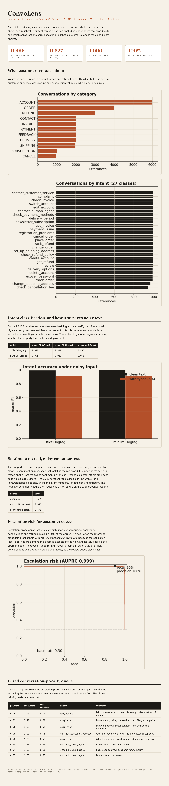

# ConvoLens

**Contact-center conversation intelligence:** turn raw customer-support messages
into the three signals an operations or customer-success team actually acts on,
what the customer wants (intent), how they feel (sentiment), and which
conversations to open first (escalation risk), with every number measured on a
held-out split rather than asserted.



The pipeline loads a public support corpus, runs exploratory analysis, trains and
honestly evaluates intent and sentiment models, scores each conversation for
escalation risk, and renders a self-contained HTML dashboard. End to end it runs
in about 30 seconds on a single GPU.

```bash
pip install -r requirements.txt
python scripts/run_pipeline.py          # full run -> reports/dashboard.html + metrics.json
python scripts/run_pipeline.py --limit 2000   # quick smoke run
pytest -q                                # 8 offline unit tests
```

## What it measures (held-out test splits)

| Task | Data | Model | Result |
|---|---|---|---|
| Intent (27 classes) | Bitext customer-support (26,872 utterances) | MiniLM embeddings + LogReg | macro F1 **0.996** |
| Intent under 6% character typos | same | same | macro F1 **0.911** |
| Sentiment (3 classes) | tweet_eval / SemEval, real tweets (official split) | MiniLM embeddings + LogReg | macro F1 **0.627** |
| Escalation risk | Bitext, intent-derived labels | embeddings + LogReg | AUROC **0.9996**, precision **1.00 @ 0.90 recall** |

Numbers are reproduced by `scripts/run_pipeline.py` and written to
`reports/metrics.json`.

## Reading the results honestly

This is the part that matters more than the headline numbers:

- **The support corpus is templated.** Its 27 intents are near-perfectly
  separable, so 0.996 macro F1 says more about the data than the model. Reporting
  it without that caveat would be misleading.
- **The informative intent result is robustness, not accuracy.** Inject realistic
  character-level typos and macro F1 drops from ~0.996 to ~0.91. That gap, not the
  clean score, is what predicts behavior on messy production text.
- **Sentiment is the genuinely hard task.** Trained and tested on real, noisy
  social posts (official benchmark split, no leakage), a frozen-embedding linear
  model reaches 0.627 macro F1, in line with strong lightweight baselines and a
  long way below the saturated support numbers. It is the honest measure of how
  far simple features carry you.
- **Escalation labels are derived from intent**, so high AUROC is expected by
  construction. The value here is not the score but the operating point it
  exposes: tuned for 90% recall, a team catches the great majority of at-risk
  conversations while keeping the review queue small.

## Fused conversation-priority queue

A single triage score blends escalation probability with predicted negative
sentiment (the sentiment head trained on real tweets, transferred to the support
text) and ranks held-out conversations by how urgently a customer-success agent
should pick them up. The top of the queue is dominated by refund frustration,
complaints, and explicit human-agent requests, exactly the conversations where
churn risk concentrates.

## How it is built

```
src/convolens/
  data.py        load + clean the support corpus, derive escalation labels
  features.py    MiniLM sentence embeddings with content-addressed disk cache
  intent.py      intent classification + typo-robustness probe
  sentiment.py   sentiment model on real tweets, reused as a risk feature
  escalation.py  escalation-risk scoring + precision/recall operating point
  report.py      matplotlib figures + editorial HTML dashboard
scripts/run_pipeline.py   end-to-end orchestration
tests/                    fast offline unit tests
```

**Stack:** Python, scikit-learn, sentence-transformers, pandas, NumPy,
matplotlib. **Datasets:** `bitext/Bitext-customer-support-llm-chatbot-training-dataset`,
`tweet_eval/sentiment` (both public, fetched via Hugging Face `datasets`).

## License

MIT
